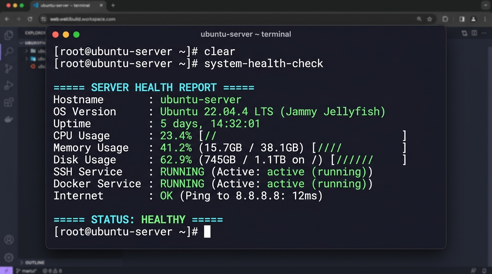

# 🖥️ Linux Server Health Monitoring Script

[](https://www.gnu.org/software/bash/)
[](https://www.kernel.org/)
[](LICENSE)

A lightweight, zero-dependency Linux server health check script written in Bash. It provides system administrators and DevOps engineers with an instant health snapshot of core system resources, critical services, and network connectivity.

---

## 📸 Demo Preview



---

## 📋 What It Checks

* **Hostname**: System identifier
* **OS Version**: Distribution name and release
* **Uptime**: How long the server has been running
* **CPU Usage**: Real-time calculated processor utilization
* **Memory Usage**: Buffer/cache-aware RAM utilization and allocation
* **Disk Usage**: Root filesystem (`/`) capacity and used space
* **Running Processes**: Total active process count
* **Critical Services**: Status of SSH daemon and Docker
* **Network Connectivity**: Internet reachability verification

---

## 📊 Example Output

```text
===== SERVER HEALTH REPORT =====

Hostname       : ubuntu-server
OS Version     : Ubuntu 22.04 LTS
Uptime         : 5 days, 4 hours
CPU Usage      : 23%
Memory Usage   : 41% (3.2GB / 8.0GB)
Disk Usage     : 62% (24GB / 40GB)
Processes      : 142 running

SSH Service    : RUNNING
Docker Service : RUNNING

Internet       : OK

===== STATUS: HEALTHY =====
```

---

## 📁 Repository Structure

```text
linux-server-health-monitor/
├── server_health.sh        # Main health check script
├── README.md               # Project documentation
├── screenshots/
│   └── demo.png            # Terminal execution screenshot
└── reports/
    └── sample_report.txt   # Example exported health report
```

---

## 🚀 Quick Start

### 1. Clone the Repository
```bash
git clone https://github.com/Shiva-Sajjanar/Linux-Server-Health-Monitoring-Script.git
cd Linux-Server-Health-Monitoring-Script
```

### 2. Make the Script Executable
```bash
chmod +x server_health.sh
```

### 3. Run the Health Check
```bash
./server_health.sh
```

---

## 💾 Exporting Reports

To automatically save a timestamped text report to the `reports/` folder:

```bash
./server_health.sh --save
```

This creates a report like:
```text
reports/health_report_20260916_114000.txt
```

---

## ⏰ Automating with Cron

You can schedule this script to run automatically and save reports every hour:

```bash
# Open crontab editor
crontab -e

# Add the following entry to run hourly:
0 * * * * /bin/bash /path/to/server_health.sh --save > /dev/null 2>&1
```

---

## 💼 Why This is a Great First DevOps / SysAdmin Project

* **Core Linux Fundamentals**: Demonstrates practical knowledge of the Linux `/proc` filesystem, process monitoring (`ps`), resource tools (`free`, `df`, `uptime`), and system services (`systemctl`).
* **Defensive Bash Scripting**: Uses `set -uo pipefail`, exit code validation, and clean POSIX command substitution.
* **Automation Ready**: Can be easily paired with cron or webhook notifications to form the foundation of a real-world server alert system.

---

## 📄 License
This project is licensed under the MIT License - see the [LICENSE](LICENSE) file for details.
