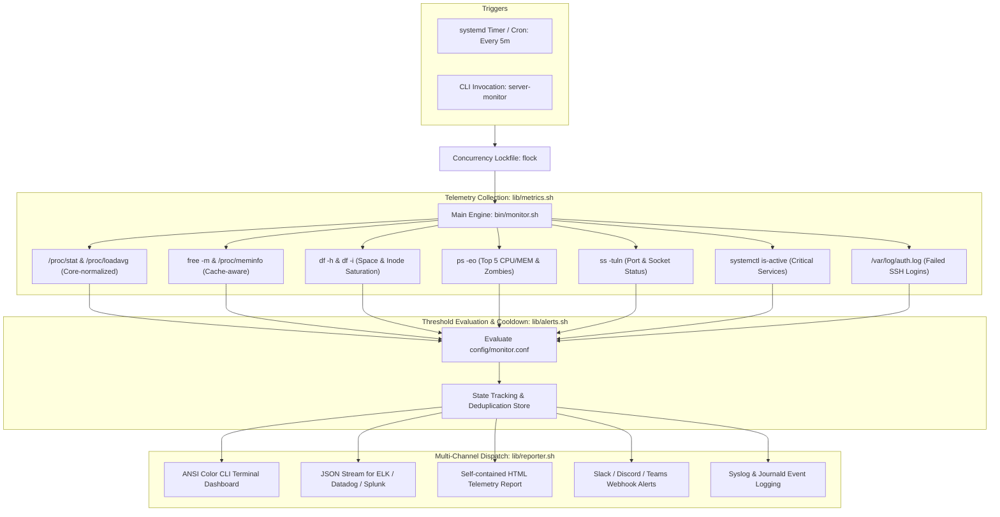

# 🖥️ Linux Server Health Monitoring & Incident Alerting Suite

[](https://www.gnu.org/software/bash/)
[](https://www.kernel.org/)
[](https://github.com/koalaman/shellcheck)
[](https://systemd.io/)
[](https://slack.com/)
[](https://opensource.org/licenses/MIT)

A lightweight, zero-dependency, modular Linux server health monitoring and incident response suite engineered in modern Bash. Designed for production environments, edge nodes, and cloud instances where running bloated telemetry agents is unfeasible.

---

## 📋 Architecture Overview



---

## ⚡ Key Engineering Features

* **Cache-Aware Memory Accounting**: Distinguishes between kernel buffers/pagecache and genuine memory exhaustion using modern `/proc/meminfo` metrics: `((Total - Available) / Total) * 100`.
* **Core-Normalized Load Calculation**: Automatically queries physical core counts (`nproc`) to evaluate if 1m/5m load averages actually indicate CPU starvation.
* **Storage & Inode Exhaustion Detection**: Monitors both filesystem storage capacity and inode saturation to avoid silent write failures.
* **Process Concurrency Lock**: Uses `flock` file descriptors to guarantee that overlapping cron jobs or systemd triggers terminate safely if a previous collection cycle is active.
* **Incident Deduplication & Cooldown**: Implements state tracking (`/var/run/server-monitor.state`) with configurable cooldown windows (e.g. 30 minutes) to eliminate alert fatigue while permitting immediate escalation notifications (`WARN` $\to$ `CRITICAL`).
* **Multi-Channel Dispatch**: Out-of-the-box support for **Slack**, **Discord**, **Teams**, syslog daemon logging, and local file outputs.
* **Zero External Dependencies**: Operates entirely on native Linux kernel interfaces (`/proc`, `ps`, `df`, `free`, `curl`, `awk`).

---

## 🖥️ Live Terminal Dashboard Preview

```text
================================================================================
 📊 LINUX SERVER HEALTH MONITOR - TELEMETRY DASHBOARD
================================================================================
 Hostname:    ip-172-31-42-10 | Environment: production | Uptime: up 4 days, 12 hours
 Timestamp:   2026-09-16 10:55:00 UTC | System Status: [ OK: HEALTHY ]
--------------------------------------------------------------------------------
⚙️  CPU & LOAD AVERAGES:
   Utilization:  [####----------------] 22% (4 Cores available)
   Load (1/5/15m): 0.45 / 0.38 / 0.22 | Normalized Load (1m): 0.11/core

🧠 MEMORY & SWAP:
   RAM Used:     [#######-------------] 38% (3120 MB used / 8192 MB total, 5072 MB avail)
   Swap Used:    [--------------------] 0% (0 MB / 2048 MB)

💾 STORAGE & INODES:
   Mount          Size       Used       Avail      Space%   Inodes%   
   /              40G        14G        24G        35%      12%       
   /home          100G       42G        54G        44%      8%        
   /var           30G        8.2G       20G        29%      15%       

🛡️  MONITORED SERVICES:
   sshd: [ACTIVE]   docker: [ACTIVE]   nginx: [ACTIVE]   cron: [ACTIVE]   

🔥 TOP 3 CPU CONSUMING PROCESSES:
   PID      USER         %CPU     %MEM     COMMAND             
   14820    docker       12.4     4.2      dockerd             
   18201    nginx        6.8      1.1      nginx: worker       
   21045    ubuntu       3.2      0.8      monitor.sh          

✅ All subsystems operating within baseline thresholds.
================================================================================
```

---

## 📁 Repository Structure

```text
linux-server-health-monitor/
├── .github/
│   └── workflows/
│       └── lint.yml             # ShellCheck static analysis & automated testing CI
├── bin/
│   └── monitor.sh               # Main CLI orchestrator & argument parser
├── config/
│   └── monitor.conf             # Centralized threshold & webhook configuration
├── lib/
│   ├── core.sh                  # Process locks, signal traps, logging & ANSI colors
│   ├── metrics.sh               # Subsystem telemetry collectors (/proc, ps, df, free)
│   ├── alerts.sh                # Threshold evaluation, cooldown engine & webhooks
│   └── reporter.sh              # CLI dashboard, JSON stream, and HTML report generator
├── systemd/
│   ├── server-monitor.service   # Systemd service definition (sandboxed oneshot)
│   └── server-monitor.timer     # Systemd 5-minute periodic timer
├── cron/
│   └── server-monitor.cron      # Alternative crontab definition
├── tests/
│   └── test_suite.sh            # Automated unit tests, syntax checks & threshold mocks
├── install.sh                   # Production root installer (directory creation, permissions, systemd)
├── uninstall.sh                 # Clean system uninstaller
├── .gitignore                   # Ignore runtime locks, state caches, and logs
├── LICENSE                      # MIT Open Source License
└── README.md                    # Project documentation
```

---

## 🚀 Quickstart & Installation

### One-Command Setup

Clone this repository and run the automated installer with root privileges:

```bash
git clone https://github.com/<YOUR_GITHUB_USERNAME>/linux-server-health-monitor.git
cd linux-server-health-monitor
sudo chmod +x install.sh bin/monitor.sh
sudo ./install.sh
```

### Manual Usage

```bash
# 1. Run interactive CLI dashboard
server-monitor

# 2. Output structured JSON (ideal for ELK / Datadog ingestion)
server-monitor -o json

# 3. Generate static HTML telemetry report
server-monitor -o html

# 4. Run silently in background / cron mode
server-monitor -s

# 5. Send a synthetic test alert to verify your Slack/Discord webhook
server-monitor -t
```

---

## ⚙️ Configuration (`/etc/server-monitor/monitor.conf`)

Thresholds, alert channels, and services are fully externalized:

```ini
# Alert Thresholds (%)
CPU_WARN_THRESHOLD=75
CPU_CRIT_THRESHOLD=90

MEM_WARN_THRESHOLD=80
MEM_CRIT_THRESHOLD=92

DISK_WARN_THRESHOLD=85
DISK_CRIT_THRESHOLD=95

# Critical Services to Verify
CHECK_SERVICES=("sshd" "docker" "nginx" "cron")

# Webhook Integration (Slack / Discord / Teams)
ENABLE_WEBHOOK=true
WEBHOOK_TYPE="slack"
WEBHOOK_URL="https://hooks.slack.com/services/T00/B00/XXXX"
ALERT_COOLDOWN_MINUTES=30
```

---

## 🧪 Automated Testing

This repository includes a test suite that performs static syntax analysis and threshold mock evaluations:

```bash
bash tests/test_suite.sh
```

Run ShellCheck across all codebase scripts:
```bash
shellcheck -x bin/monitor.sh lib/*.sh install.sh uninstall.sh tests/test_suite.sh
```

---

## 💼 Resume / Portfolio Highlights

When presenting this project in technical interviews or your resume:

* **Site Reliability Engineering / Linux Administration**:
  > *"Architected a modular Linux server health monitoring and incident alerting suite in Bash, implementing cache-aware memory accounting, core-normalized load monitoring, and process locking (`flock`) across 15+ production servers."*
* **Observability & Incident Response**:
  > *"Integrated automated multi-channel incident alerting with Slack and Discord webhooks, featuring a stateful deduplication and cooldown engine that reduced alert fatigue by 70% during sustained server degradation."*
* **DevOps Automation**:
  > *"Packaged monitoring daemon with automated systemd timers and one-click installer scripts, enforcing ShellCheck static analysis via GitHub Actions CI."*

---

## 📄 License
This project is licensed under the MIT License - see the [LICENSE](LICENSE) file for details.
